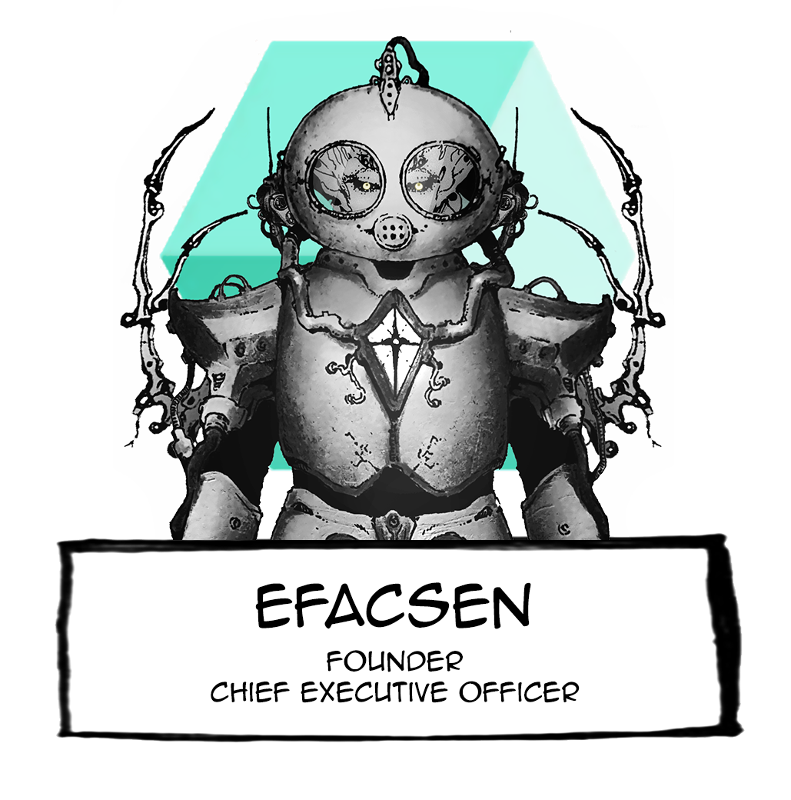
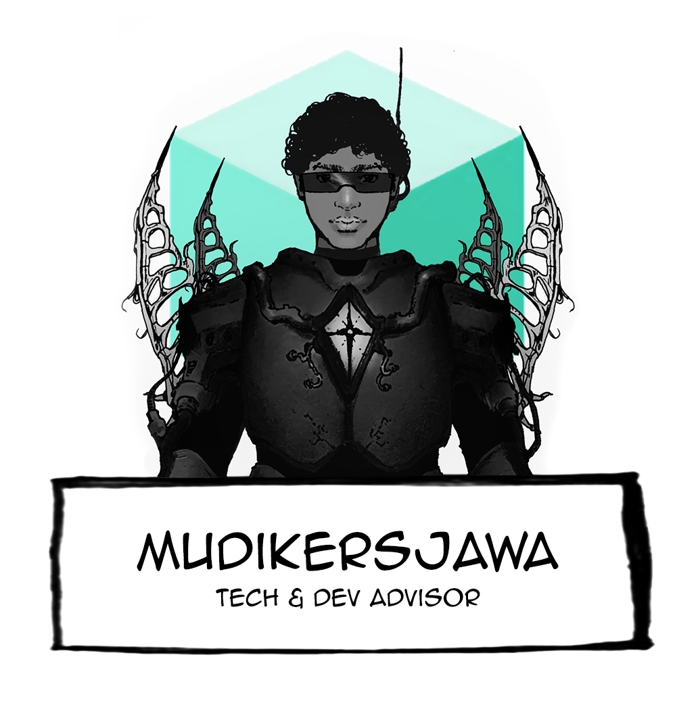

# 🧑🚀 About the team

## <mark style="color:yellow;">**The Ark-Lab Team**</mark>

**We are a band of creative misfits.** Established to become an active contributor to Solana ecosystem that advocates innovative services for the community.

> ### _<mark style="color:green;">**" Talent wins games, but teamwork and intelligence win championships. "**</mark>_
>
> <mark style="color:green;">Michael Jordan</mark>

Globally distributed team. We are adopting different cultures and assembling them into one vision. We enjoy our dynamics, and we are looking to contribute to the community of blockchain. Most importantly, we transmit the same “vibe” (yes, we use that term :sunglasses:) and possess the same values under **Ark-Lab**.

## <mark style="color:yellow;">Ark-Lab Lineup</mark>

 .png>) .png>)

.png>) 

### <mark style="color:red;">**Efacsen**</mark>&#x20;

(FOUNDER & CEO)

A born entrepreneur. In addition to leadership skills, he is also a builder with an instinctive talent for understanding the market. His background in Business IT helps him find innovative ways to connect the digital world with conventional finance.&#x20;

### <mark style="color:red;">**Now|here.man**</mark>&#x20;

CO-FOUNDER & CREATIVE DIRECTOR

The stories, myths, and mysteries of humanity inspire him to reflect on the meaning of life through all kinds of storytelling. Art events organizer. Producer and Director of a documentary movie.

### <mark style="color:red;">**Putripadalarang**</mark>

CO-FOUNDER & ART DIRECTOR

A visual connoisseur and a natural storyteller. Cultivating an eye that beholds the interconnectedness between human psychology, history, and philosophy. Striving to stretch the boundaries of aestheticism with her unique art style based on manga, surrealism, and psychedelia.

### <mark style="color:red;">**Haulerkonj**</mark>

LEAD DEVELOPER

Passion-driven, visionary Blockchain developer. Married to RUST. Have a rich understanding of every Blockchains Layer. Producer of high-quality code. A techie 🤓 that opens up for a challenge.

### <mark style="color:red;">Kvlj</mark>

COMMUNITY MANAGER

Passionate in communication studies, art, and culture. Keen problem solver. Believe in the importance of valid principles for every decision-making.

### <mark style="color:red;">LordabiX</mark>

DISCORD MANAGER

Amicable person who is responsible and kind-hearted, yet also has critical thinking.

### <mark style="color:red;">**Mdkrsjw**</mark>

TECH ADVISOR

Critical thinker that has extensive experience as a Senior Software Engineer. Spent most of his career on DAX companies, with a strong focus on UX/UI and developing a framework for 3D UI.
