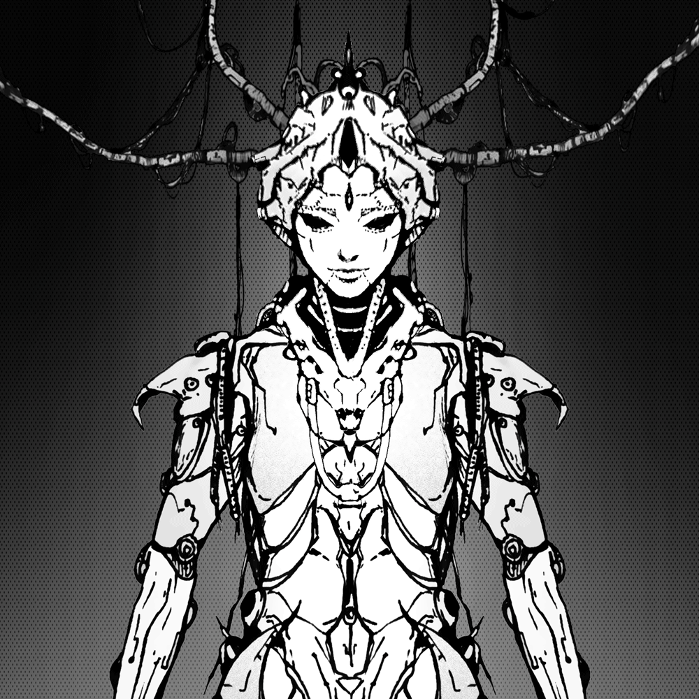

# 🖼 TCA NFTs

## <mark style="color:yellow;">A.N.I.M.A</mark>

First phase of The Cognitive Ark will be started by releasing _**100 exclusive NFTs**_ codenamed A.N.I.M.A.&#x20;

"_`Among the survivors who inhabited the Mothership Messiah, some machine-like figures could be found roaming around over the years. They possessed humanlike faces, expressing emotions just like humans, and even speaking like one. Some would say that they're almost exactly like humans in cyber bodies. They don't appear hostile; instead, they seem to aid in the development of the colony. To this day, their origins remain a mystery.`_"

The Cognitive Ark <mark style="color:yellow;">**OG-Colony**</mark> will have the opportunity to _**pre-mint 1 A.N.I.M.A**_ (prior to gen0 release). If there is some A.N.I.M.A left to mint, it will be open for the public to mint.

The benefits for holding A.N.I.M.A is as follows:

* Exclusive, limited supply
* **Free pass to mint 1 gen0 for free**
* Playable in the Timeline gamification
* Can be staked to earn $ARK
* Part of [_Epic Pool_](https://docs.cognitiveark.io/injecting-new-nft-culture/usdark-tokenomics#usdark-distribution) __ (Earn more $ARK)
* Access unique role on Discord

## <mark style="color:yellow;">The Cognitive Ark gen0 (The Genesis)</mark>

The Cognitive Ark gen0 named "**Memory**" initiated. The Ark will soon release **3050** scattered **memories** and populate Solana Ecosystem ☄️. Be a part of the Colony that will terraform the NFT space 🛸.

* <mark style="color:red;">**TBA**</mark> XXX Memories reserved for Whitelist minting&#x20;
* <mark style="color:red;">**TBA**</mark> XXX Memories reserved for Public minting
* 100 Memories reserved for A.N.I.M.A holder
* 50 Memories reserved for Giveaway and Partnership program

### Utilities

All of the gen0 **Memory** will possess these fundamental utilities:

* Exclusive, limited supply
* Memory holders can play the Timeline gamification to earn rewards
* Memory can be staked to earn $ARK
* Ability to become a member of the Colony council for ArkDAO
* Access unique role on Discord

