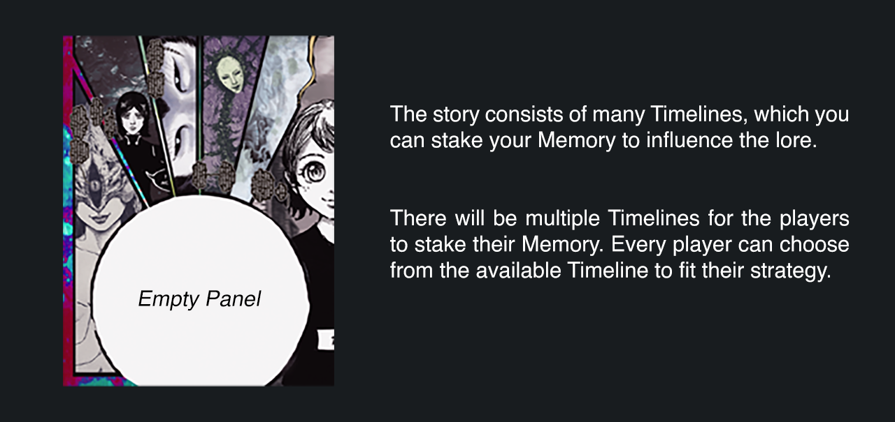

# 🎮 Gamification

## Introduction

To understand what we aim to do, we need to step back and analyze the gaming industry that we are familiar with. Most centralized MMORPG games have their economy thrive because they do not allow the players to cash out or sell the in-game currency directly to other players. To put it in another way, they do not own the assets. Decentralized games aim to change this fundamental issue. They want to give the ownership back to the player's hands. But this comes with a high cost too, as most people in this space come from the DeFi scene. The people are primarily investors who fundamentally pursue the profit and not the actual players who love, appreciate, and enjoy the game. Early investors have advantages over the player who joined at a later stage as the early adopters will use the newer player as their exit liquidity. This cycle persists until the project cannot sustain the selling pressure and burns the project to the ground.

Here every player has the same opportunity to win the rewards, the time you join our community doesn't dictate the odds of winning, and there is **ZERO** risk to be dumped on by early investors!


_This mechanism will allow us to sustain the project and create an authentic community that plays around the concepts and values the work we put into it!_


## Getting Started

Our gamification will based on the Story and Lore of The Cognitive Ark.\
The story will progress after the Memory Holder can reveal hidden mysteries and plot.

## The Memory

CognitiveArk gen0 NFT is called **Memory.** As a Memory holder, you will play a role in the main story. \
\
There are 4 types of Memory, based on its rarity:

* Memory of The Present (_Rare_)
* Memory of The Past (_Very Rare_)
* Memory of The Future (_Epic_)
* Unknown Memories (_Common_)

## The Timeline

## Game Mechanics

CognitiveArk NFT has a different approach to P2E. We allocate a considerable reward to our Memory holders for really playing and a premium reward on top for scoring the most points. The game mechanics is straightforward:

#### 1. Stake your Memory on the empty panel on the Timeline.&#x20;

.gif>)

#### 2. Choose a narrative bubble and drag it to the correct position. Each correct narrative bubble and each correct bubble position will give the player more points.

.gif>)

#### 3. After you stake your Memory, your Memory will be locked for two days before you can unstake it.

#### 4. To change the narrative bubble or the position, you need to unstake your Memory.

The Team will update the new Timeline on the website.

### Timeline Cycle

One cycle of Timeline will last for two weeks. Each Timeline will have one or more empty panels. The panels will feature a side quest that gives players bonus points and $ARK multiplier. After the cycles ended, the Lore Master will assess all players' interpretations and give up to 30 points to the closest accurate narration.


_Make sure you put your Memory in the right slot to get bonus points and a reward multiplier to amplify your $ARK gain._


### Points

* 10 pts for every correct narrative bubble
* 10 pts for every correct bubble position
* 10 pts for special panel
* 1-30 pts from story interpretations

### Leaderboard

The Leaderboard will show the current points and the total points from previous Timeline cycles. The Team will update it four days after the end of each Timeline cycle (2 weeks). Users who score the most points on that Timeline will win the game.

## Colony Lottery

Colony Lottery will be happening one week after each Timeline cycle ends. So there will be 2 Colony Raffles each month in total. Each Colony can swap their $ARK for Colony Lottery Ticket (CLT). There is currently no limit on how many CLT each wallet can use for each raffle.


_**Ten lucky Colonies** will be randomly selected and will get a $UST airdrop._


> _Colony Lottery Ticket price will be set to **1 CLT = 10 $ARK**_


_There is no correct answer on when you will spend your $ARK for CLT. You can always participate in each raffle or skip 1 Colony Lottery to get a better chance at the next one. It will depend on your strategy._


Learn more about the Colony Lottery Pools in [Reward System](reward-system.md).

## **TL;DR**

Too lazy; didn't read 🦉

* Immerse yourself in the storyline
* Stake your Memory in the Timeline
* Earn as many points as possible
* Earn Rewards
* Repeat 🔁
